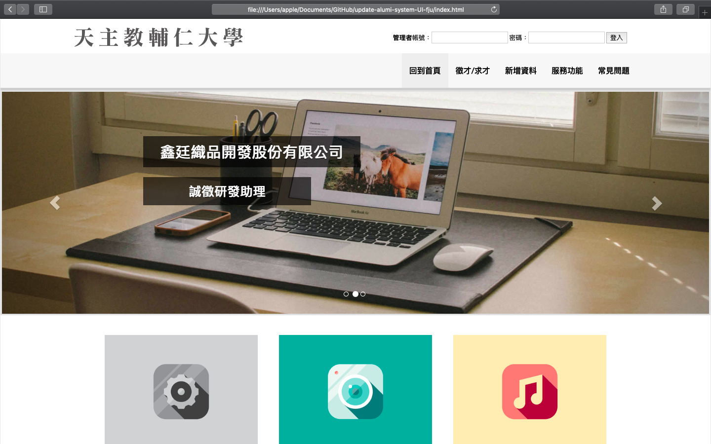
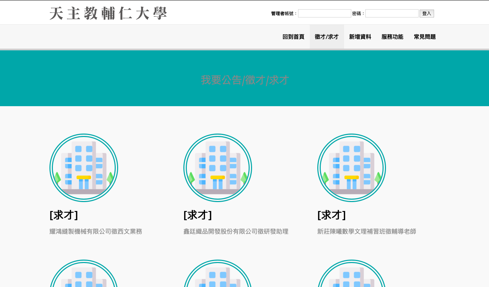
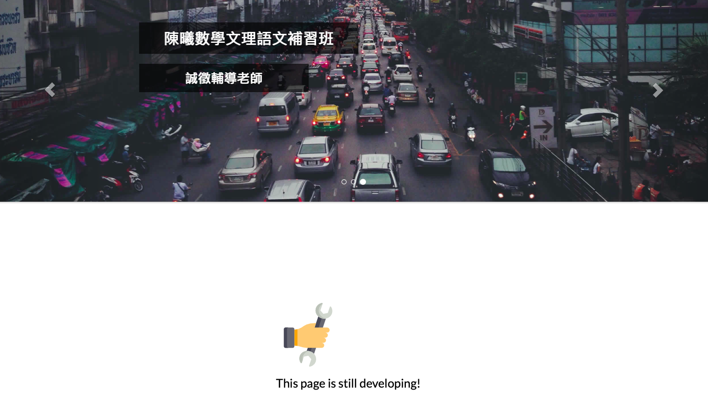

## Redesigned outdated website - FJU alumi systen webpage

The outdated webpage is not user-friendly. When you want to find information in this webpage, you always have to link to other tab to find out the link. Therefore, I decide to redesign the UI for this system.

### Outlook

1. This is the index page I made.

   

2. In Hiring page, you can see there some companies icon you can edit. Also, there are some links you can link to.

   

3. There are still some pages need to redesigned. So I redesigned this page like this.

   

